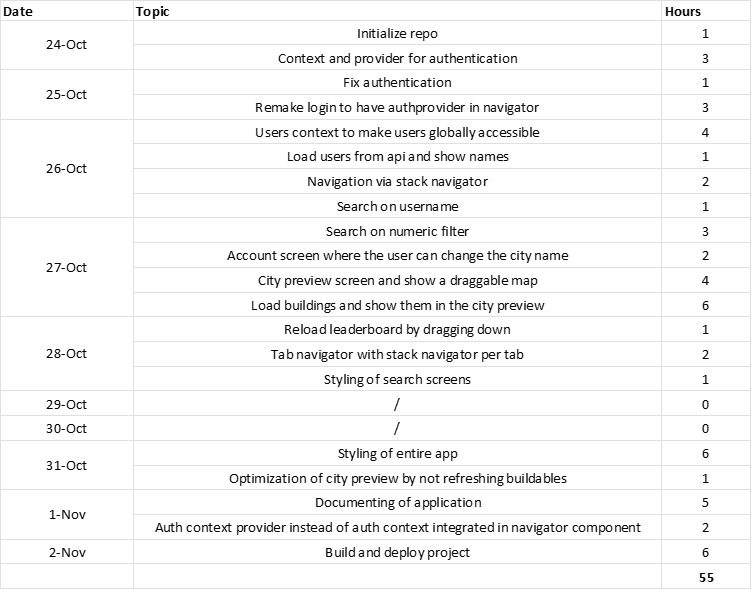

# Pokemon City Stats

Hello and welcome to the project documentation of Pokemon City Stats. This is a supplementary application in the Pokemon City series. Specifically to have a look into the global statistics of all players.

## What is Pokemon City Stats

Pokemon City Stats is a mobile application that allows the user to compare his or her stats with the whole world. The apps includes a leaderboard, a search function for users, user details and a preview of users their city.

The login is directly linked to the Pokemon City game so that the user can login with his/her own account created when registering on the game platform.

## How to use

### Leaderboard

On the leaderboard, all users are ranked by score. The top 3 players are ranked by gold, silver and bronze colours. Score is determined by overall performance in the game. You can tap on a player to view a detailed information screen

### User details

By tapping on a player, you can view his/her details. The details include all statistics of the user. The details screen also includes a button to open the city of that user.

### Search

-   Search by username: You can type a username and the app searches all the users of which the username starts with the typed text
-   Search by numeric filter: You can filter users on their level and score by using the numeric filter

### Account

On the account screen, the player can see his/her own detail and also change the name of the city.

### City preview

The city preview loads the city of the selected user. The user can move the camera by dragging on the screen. Its not possible to interact with buildings for security reasons.

### Loading

## Planning

1. Find general idea

    Before I could start designing the application, I had to find a general idea for the app and list the core functionalities.

2. Create screens

    Now it was time to design the screens that my app would include. I also thought about how navigation should be designed and settled with a bottom navigation bar with a nested stack navigation.

    I drew the screens on paper, and didn't use any program to create wireframes, since the application won't consist of too many screens.

    

3. Extend api with new endpoints

    Knowing api design is not the scope of this project and won't be graded. It was still a step to be undertaken to create the mobile application. A few endpoints needed to be added, which serve for user filtering.

4. Setup the project

    Before starting to code, I had to setup the react-native project. I chose to use TypeScript support, since I find it more powerful and bug-safe since it is typed.

    Then the folder structure needed to be created. From the beginning, I tried to decouple the api communication from the react components. Therefore I made an 'api' folder containing services that execute the api calls

5. Code the app

    Now it was time to start coding the app. Of course it was with its ups and downs, but there was only one major problem where I was stuck for a significant amount of time.

    On the 'city preview' screen, a list of objects gets loaded from the api and saved in a state as objects. To draw these objects, they got mapped to a component in the return of this screen. For a still unknown reason, the list of the objects in the state gets updated every time the screen gets dragged. The solution for this is doing the mapping not in the return but map them in a 'useEffect' and saved this JSX.Element array in a state.

6. Deployment

    Deployment is always one of the hardest parts in creating an application, also this time. But, after a day of build errors, I finally got the debug apk working!

## Time Spend

To Track how much time I created an excel sheet tracking my daily progress:

## New Topics

### Bottom Navigation

During the courses of Mobile Application Development, we learned how to use the stack navigator of react-native. It was until creating my research assignment that I didn't fully understand how it worked. But after implementing a stack navigator from scratch that is nested in a bottom navigator, I can say that I really understand the workings of both of these kinds of navigation.

### Global Context From Scratch

I really wanted to build up my own context system from scratch without using some kind of library like redux for state management. This is where I encountered the context hooks.

I found it was super easy to create a context provider for objects you want to make global:

1. Register them with 'createContext' from react
2. Create a context provider component that will wrap all components that need this context (comparable to the 'Provider' with a store in redux)

The context providers are created as following:

1. Declare the interface of the context value
    - Contains the value itself
    - Contains a setter function
2. Declare a state that will hold the value of the context with 'useState' react hook
3. Initialize that state with a new object that implements the declared interface:
    - The value: Your initial value
    - The setter: A function that calls the 'setState' of the react hook which holds your state

Now the context object is available with the 'useContext' hook in every component wrapped by the provider. Calling the setter on this context object will do the following:

-> Call Setter

-> Calls the setter of the state in the provider component

-> Sets the state to the provided value, but the same setter function

## Overall feeling

Looking back on this project, i'm super happy. I think its a great project for the time I spent on it. Its not the biggest I've ever made but I feel like its useful.

I also learned a lot about react-native and I really fel in love with this technology. The part I'm proud of the most is the global context system from scratch.

The project certainly meets all the requirements, but there is always room for improvement of course:)

That's why I would score my project a 9/10.

## Download

[Download the apk](https://lennertsoffers.be/hosting/pokemon-city-stats.apk)